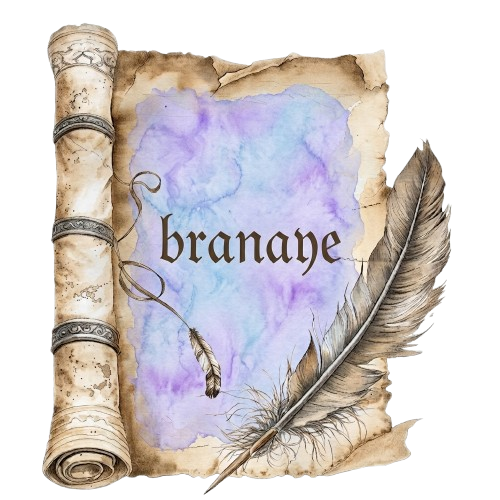
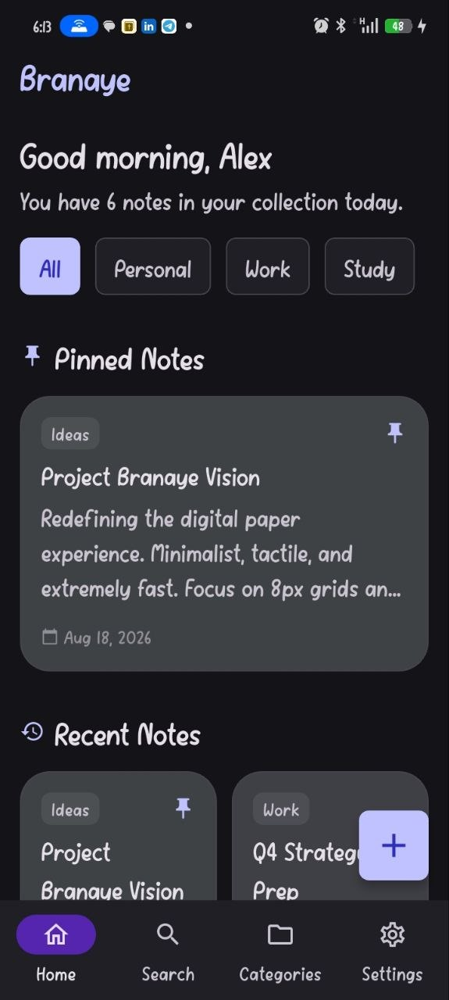
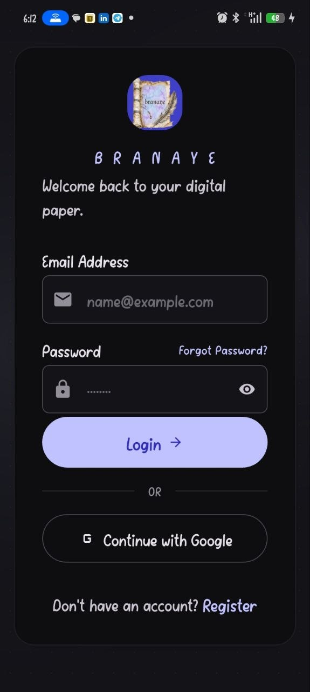
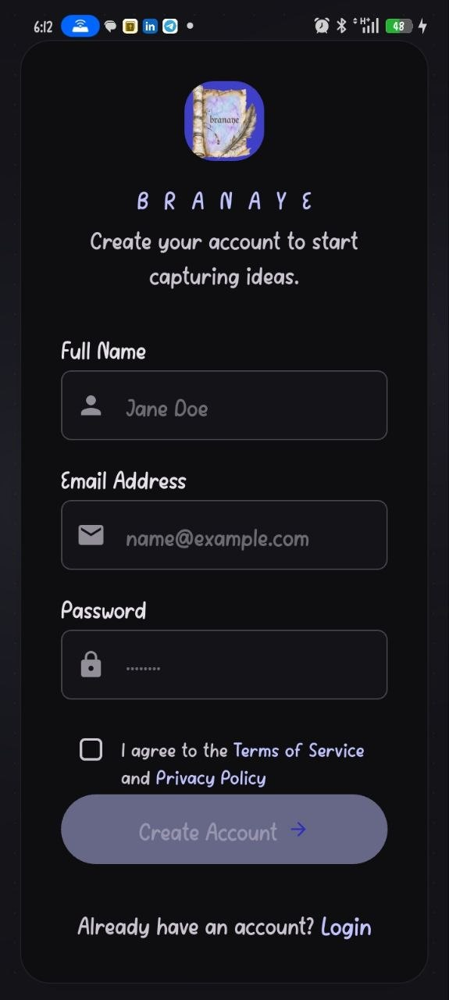
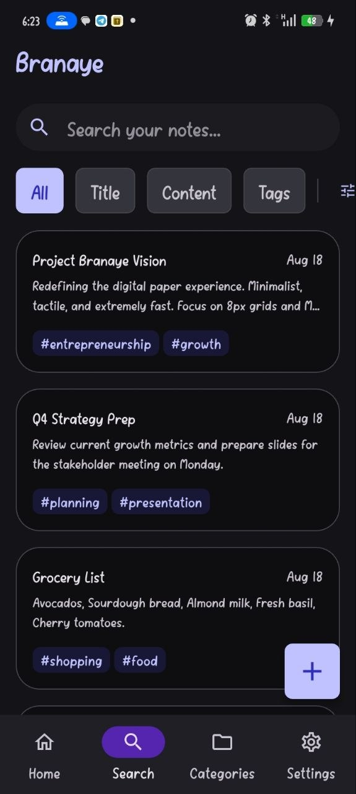
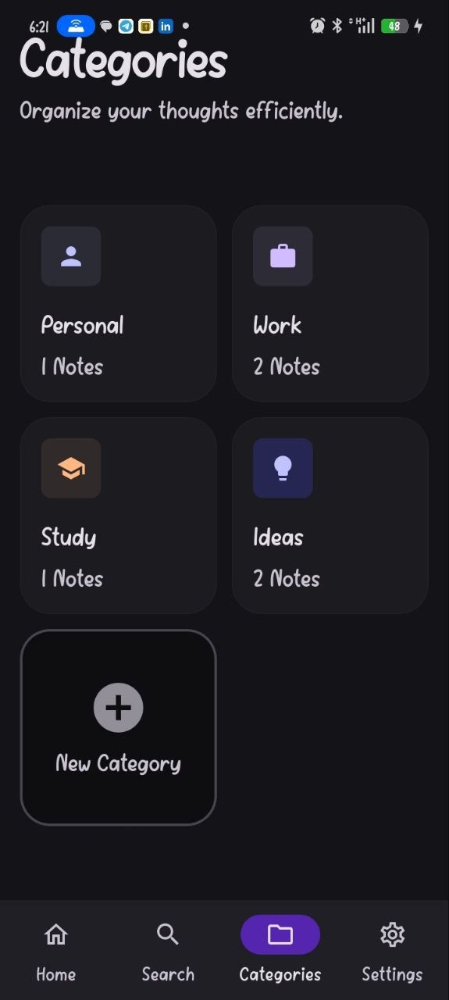
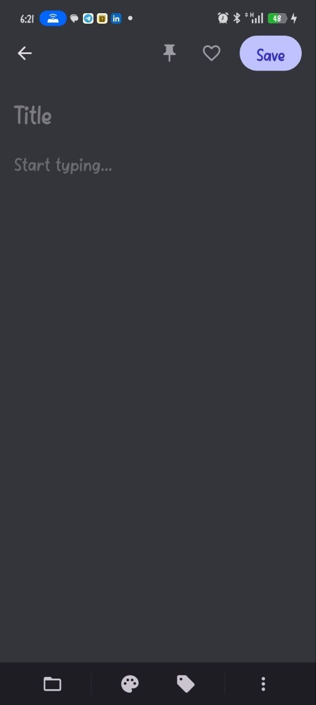
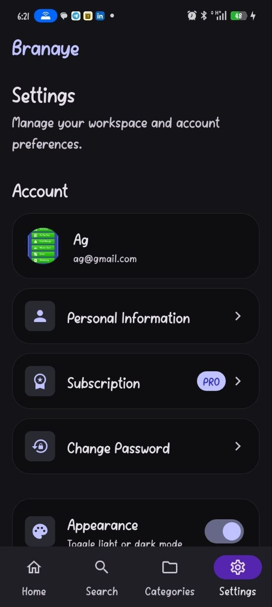

<div align="center">



# Branaye

**Your Digital Paper — Capture, Organize, and Preserve Your Thoughts**

[](https://flutter.dev)
[](https://dart.dev)
[](LICENSE)

</div>

---

## About Branaye

Branaye is a beautiful, minimal note-taking app built with Flutter. Inspired by the ancient Ethiopian script **Branaye** (በረናዬ), this app helps you capture, organize, and preserve your thoughts with elegance and simplicity.

<div align="center">

</div>

---

## Features

### Core Functionality
- **Rich Note Editor** — Create and edit notes with title, content, and color coding
- **Smart Categories** — Organize notes into custom categories with icons
- **Search & Filter** — Find notes instantly with real-time search
- **Favorites & Archive** — Pin important notes or archive completed ones

### User Experience
- **Dark & Light Mode** — Beautiful themes that adapt to your preference
- **Adjustable Text Size** — Small, Default, or Extra Large for comfortable reading
- **Multi-Language Support** — Choose from multiple languages
- **Swipe Actions** — Quick actions on notes (pin, favorite, archive, delete)

### Security
- **App Lock** — Protect your notes with PIN or biometrics
- **Biometric Unlock** — Use Fingerprint or Face ID for quick access
- **Lockout Timing** — Customizable auto-lock duration
- **Privacy Controls** — Hide sensitive content in notifications

### Account & Sync
- **Personal Information** — Customize your profile with photo and details
- **Sync & Backup** — Keep your notes safe across devices
- **Subscription Plans** — Free tier with Pro options available

---

## Screenshots

<div align="center">

| Login | Register | Home | Search |
|:-----:|:--------:|:----:|:------:|
|  |  |  |  |

| Categories | Editor | Settings |
|:----------:|:------:|:--------:|
|  |  |  |

</div>

---

## Tech Stack

| Layer | Technology |
|-------|------------|
| **Framework** | Flutter 3.x |
| **Language** | Dart 3.x |
| **State Management** | Riverpod 3.4.2 |
| **Navigation** | GoRouter 17.5.0 |
| **Local Storage** | SharedPreferences |
| **Image Picker** | image_picker 1.0.7 |
| **UI Kit** | Material Design 3 |

---

## Architecture

```
branaye_mobile_app/
├── mobile/                    # Flutter mobile app
│   ├── lib/
│   │   ├── core/
│   │   │   ├── models/        # Data models (Note, User)
│   │   │   ├── router/        # GoRouter configuration
│   │   │   └── theme/         # App theme, colors, typography
│   │   ├── data/
│   │   │   └── providers.dart # Riverpod providers & state
│   │   ├── features/
│   │   │   ├── auth/          # Login & Register screens
│   │   │   ├── categories/    # Categories management
│   │   │   ├── editor/        # Note editor
│   │   │   ├── home/          # Home screen with note grid
│   │   │   ├── notes/         # Filtered notes (favorites, archive)
│   │   │   ├── search/        # Search functionality
│   │   │   └── settings/      # All settings screens
│   │   └── img/               # App assets & images
│   └── pubspec.yaml
├── backend/                   # Node.js backend (planned)
├── .gitignore
└── README.md
```

---

## Getting Started

### Prerequisites

- [Flutter SDK](https://flutter.dev/docs/get-started/install) (3.x or higher)
- [Dart SDK](https://dart.dev/get-dart) (3.x or higher)
- Android Studio / VS Code
- Android/iOS emulator or physical device

### Installation

1. **Clone the repository**
   ```bash
   git clone https://github.com/yourusername/branaye.git
   cd branaye_mobile_app/mobile
   ```

2. **Install dependencies**
   ```bash
   flutter pub get
   ```

3. **Run the app**
   ```bash
   flutter run
   ```

---

## App Screens

### Authentication
| Screen | Description |
|--------|-------------|
|  **Login** | Sign in with email and password |
|  **Register** | Create a new account |

### Main Navigation
| Screen | Description |
|--------|-------------|
|  **Home** | View all notes in a masonry grid |
|  **Search** | Find notes by title or content |
|  **Categories** | Organize notes by custom categories |
|  **Editor** | Create and edit notes |

### Settings
| Screen | Description |
|--------|-------------|
|  **Settings** | Customize your experience |
| **Personal Information** | Edit profile, photo, and details |
| **Subscription** | View plans and pricing |
| **Security** | App lock, biometrics, PIN |
| **About Branaye** | App info, privacy policy, terms |

---

## Design System

### Colors
| Color | Hex | Usage |
|-------|-----|-------|
| Primary | `#4648D4` | Main brand color |
| Secondary | `#6B38D4` | Accent elements |
| Background | `#F8F9FF` | Screen background |
| Surface | `#FFFFFF` | Cards and containers |
| Error | `#BA1A1A` | Error states |

### Typography
- **Font Family:** Inter
- **Display:** 45px / 700 weight
- **Headline:** 28-32px / 600 weight
- **Title:** 16-22px / 500 weight
- **Body:** 14-16px / 400 weight
- **Label:** 11-14px / 500 weight

### Spacing
- **Margin Mobile:** 16px
- **Margin Tablet:** 24px
- **Stack Small:** 4px
- **Stack Medium:** 16px
- **Stack Large:** 32px

---

## Learning Journey

This project is built as a learning exercise covering:

- **Flutter & Dart** — UI widgets, state management, navigation
- **Riverpod** — Modern state management with providers
- **GoRouter** — Declarative routing with nested navigation
- **SharedPreferences** — Local data persistence
- **Material Design 3** — Modern UI components and theming
- **Clean Architecture** — Separation of concerns and code organization
- **Responsive Design** — Adapting to different screen sizes

---

## Development Roadmap

- [x] Core UI (Home, Search, Categories, Editor)
- [x] Authentication (Login, Register)
- [x] Settings (Profile, Text Size, Language, Sync)
- [x] Security (App Lock, Biometrics, PIN)
- [x] About Section (Rate Us, Report Bug, Policies)
- [ ] Backend API (Node.js + Express + PostgreSQL)
- [ ] Cloud Sync
- [ ] Push Notifications
- [ ] Testing Suite

---

## Contributing

Contributions are welcome! Please feel free to submit a Pull Request.

1. Fork the repository
2. Create your feature branch (`git checkout -b feature/AmazingFeature`)
3. Commit your changes (`git commit -m 'Add some AmazingFeature'`)
4. Push to the branch (`git push origin feature/AmazingFeature`)
5. Open a Pull Request

---

## License

This project is licensed under the MIT License — see the [LICENSE](LICENSE) file for details.

---

<div align="center">

**Made with ❤ in Ethiopia**

© 2024 Branaye Inc. All rights reserved.

</div>
